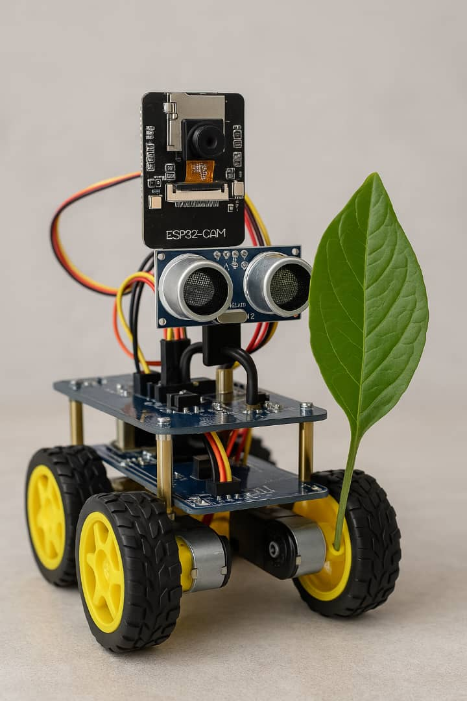
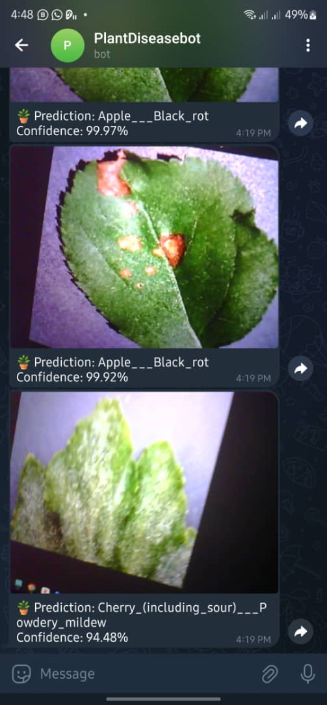

# 🌿 Smart Plant Disease Detection and Reporting System

This project is a **final year engineering project** focused on developing a smart system that detects plant diseases using machine learning and reports them via a Telegram bot. It combines **computer vision**, **ESP32-CAM**, **robotic mobility**, and **IoT** to provide farmers with real-time insights on plant health.

---

## 🔍 Project Overview

The system captures images of plant leaves using an **ESP32-CAM module** mounted on a mobile robot. These images are then sent to a **Flask server**, where a **convolutional neural network (CNN)** model trained on the PlantVillage dataset analyzes them to detect whether the plant is healthy or diseased. If a disease is detected, a notification is sent instantly via **Telegram**.

---

## 📦 Dataset

We used the **PlantVillage Dataset**, which contains thousands of labeled images of healthy and diseased plant leaves.

📥 Download the dataset here:  
👉 [PlantVillage Dataset on Kaggle](https://www.kaggle.com/datasets/mohitsingh1804/plantvillage/code)

Or download using
```
# 1. Install the Kaggle API
pip install kaggle

# 2. Create the Kaggle directory to store your API key
mkdir -p ~/.kaggle

# 3. Add your Kaggle API credentials (replace with your actual username and key)
echo '{"username":"iwuaustinchris","key":"2259848aa102039244299f551234da67"}' > ~/.kaggle/kaggle.json

# 4. Set proper file permissions for the API key
chmod 600 ~/.kaggle/kaggle.json

# 5. Download the PlantVillage dataset from Kaggle
kaggle datasets download -d mohitsingh1804/plantvillage

# 6. Unzip the downloaded dataset
unzip plantvillage.zip -d PlantVillage
```

---
## Install requirements

```
pip install numpy pandas matplotlib seaborn tensorflow tensorflow-addons efficientnet tensorflow-hub kaggle kagglehub opencv-python
```
---

## 🖼️ Image Previews

### 🔧 Hardware Prototype

This is what the hardware robot with the ESP32-CAM should look like:



### 📲 Telegram Notification

Below is a preview of the Telegram notification received when a plant disease is detected:



---

## 🚀 Features

- ESP32-CAM captures live plant images
- Sends images to Flask server via HTTP
- CNN model classifies the plant health status
- Telegram bot sends instant disease alerts
- Ultrasonic sensors allow autonomous mobility

---

Feel free to fork, contribute, and improve this project!
